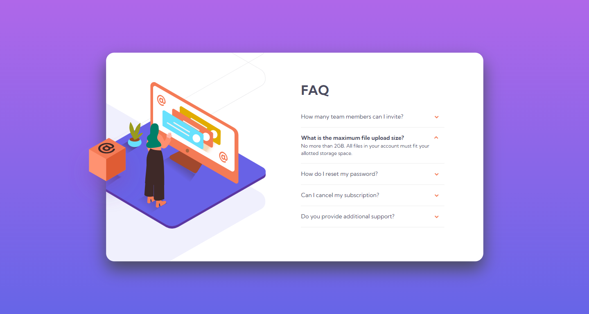

# Frontend Mentor - FAQ accordion card solution

This is a solution to the [FAQ accordion card challenge on Frontend Mentor](https://www.frontendmentor.io/challenges/faq-accordion-card-XlyjD0Oam). Frontend Mentor challenges help you improve your coding skills by building realistic projects.

## Table of contents

- [Overview](#overview)
  - [The challenge](#the-challenge)
  - [Screenshot](#screenshot)
  - [Links](#links)
- [My process](#my-process)
  - [Built with](#built-with)
  - [What I learned](#what-i-learned)
  - [Continued development](#continued-development)
- [Author](#author)

## Overview

### The challenge

Users should be able to:

- View the optimal layout for the component depending on their device's screen size
- See hover states for all interactive elements on the page
- Hide/Show the answer to a question when the question is clicked

### Screenshot



### Links

- [Solution URL](https://github.com/sayednaser/faq-accordion-card-frontendmentor)
- [Live Site URL](https://sayednaser.github.io/faq-accordion-card-frontendmentor/)

## My process

### Built with

- Semantic HTML5 markup
- CSS
- Flexbox
- Mobile-first workflow

### What I learned

There were two main challenges in this, well, challenge. First, it required some manipulations and accurate measurements to get the hero image right. Second, it required some hack solutions to implement the accordion in pure CSS. Let's discuss the major points in detail, with code snippets.

Linear gradient is a directed line, passing through the origin of a box. The start and end points are determined by perpendeculars passing through the two vertices in the same quarters as the two points, respectively. Every point on the line has a color. By drawing a perpendecular at every point with that color, we have the gradient effect. We can set some parameters like gradient-line direction, color-points and middle-points between two color-points.

```css
body {
  background-image: linear-gradient(
    to bottom,
    hsl(273, 75%, 66%),
    hsl(240, 73%, 65%)
  );
}
```

---

Hero image is a little complicated and has different implementations for mobile/desktop versions.

For mobile, we set it as a background image on the ::before element and absolutely positioned it. For the shadow, we need to use a drop-shadow filter.

```css
.card {
  position: relative;
}

.card::before {
  display: block;
  content: "";
  width: 100%;
  height: 18rem;

  background-image: url(images/illustration-woman-online-mobile.svg);
  background-position: top;
  background-repeat: no-repeat;

  position: absolute;
  top: -10.8rem;

  filter: drop-shadow(0 3.2rem hsl(240, 67%, 96%));
}
```

For desktop, we set a width on the ::before element and let it be the height of entire card. We let flexbox do the layout. We position the background image to right to achieve the clipping effect on the left side. We also position it relative to the bottom, so that when the card height increases, the image moves down with it.

```css
.card {
  max-width: 92.1rem;
  min-height: 50.9rem;
  display: flex;
}
.card::before {
  position: static;
  width: 38.9rem;
  height: inherit;
  filter: none;

  background-image: url(images/illustration-woman-online-desktop.svg),
    url(images/bg-pattern-desktop.svg);
  background-position: bottom 8rem right, bottom -12.4rem right;
}
```

For the box, we implemented as a background image for the ::after element. We absolutely position it, relative to bottom, just like the main image is, so that they move together perfectly.

```css
.card::after {
  display: block;
  content: "";
  width: 19.1rem;
  height: 18.4rem; /* Intrinsic image size */

  background-image: url(images/illustration-box-desktop.svg);
  background-repeat: no-repeat;
  background-position: top left;
  position: absolute;
  bottom: 12rem;
  left: -9.3rem;
}
```

---

Implementing the accordion, we need to save state whether the question is clicked on. There is no state in CSS, but we can achieve it using a hidden checkbox. A checkbox is toggled on every click on the label associated to it. We can nest the question inside a label element.

```html
<div class="faq-instance u-margin-small">
  <input type="checkbox" name="" id="q1" class="checkbox-hidden" />

  <label for="q1"
    ><p class="question">How many team members can I invite?</p></label
  >
  <p class="answer">
    You can invite up to 2 additional users on the Free plan. There is no limit
    on team members for the Premium plan.
  </p>
</div>
```

```css
.question {
  cursor: pointer;
}
.checkbox-hidden {
  display: none;
}
.answer {
  display: none;
}
```

Then we have the ability to apply the styles we want only when checkbox::checked

```css
.checkbox-hidden:checked + label > .question {
  font-weight: 700;
}
.checkbox-hidden:checked ~ .answer {
  display: block;
}
```

### Continued development

- Using Figma more, for more accurate measurements.

## Author

- Github - [@sayednaser](https://github.com/sayednaser)
- Frontend Mentor - [@sayednaser](https://www.frontendmentor.io/profile/sayednaser)
